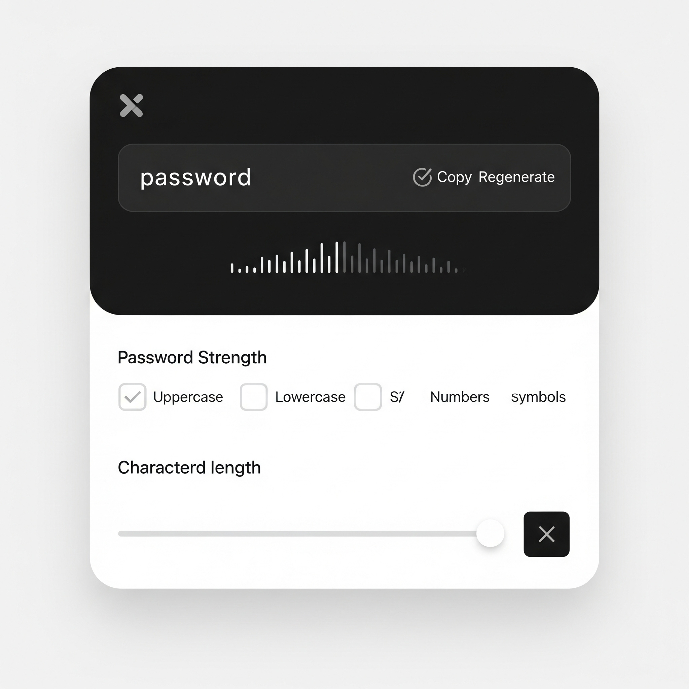

# UI イメージ・設計

## トップページ

- サービス名・説明
- オプション選択フォーム
  - 文字数（6, 8, 任意入力）
  - 記号含む（チェックボックス）
  - 大文字含む（チェックボックス）
  - 小文字含む（チェックボックス）
  - uuid/sha256 生成（ラジオボタン or セレクト）
- 生成ボタン
- 結果表示欄
- コピー用ボタン

---

## ワイヤーフレーム（テキスト）

```md
+-------------------------------+
| パスワード自動生成サービス |
+-------------------------------+
| [文字数: 6 8 [ ] ] |
| [ ] 記号含む |
| [ ] 大文字含む |
| [ ] 小文字含む |
| ( ) パスワード ( ) uuid ( ) sha256 |
| [ 生成 ] |
|-------------------------------|
| 生成結果: xxxxxxxx |
| [ コピー ] |
+-------------------------------+
```

## UI イメージ



- 日本語でお願いします。
- ダークモードも対応してください。
- 複雑で安全なパスワードほど良いのでインジケーターを表示してください。
  - 赤: 非常に弱い
  - オレンジ: 弱い
  - 黄: 普通
  - 緑: 強い
